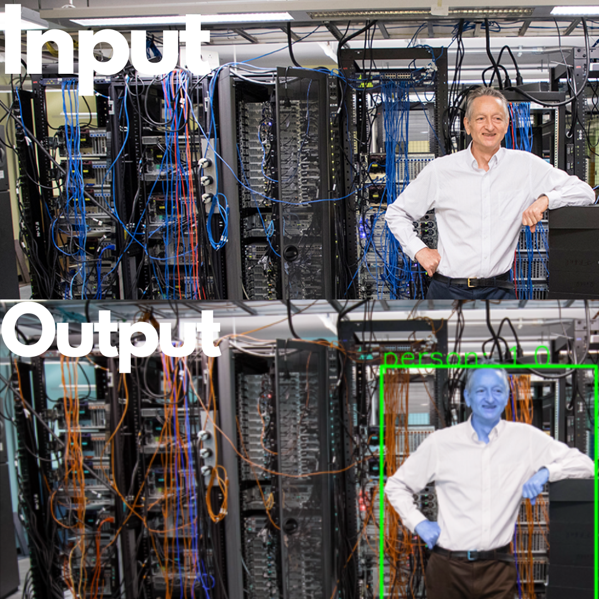

# Object-Detection-using-Faster-R-CNN

This repository contains code for object detection using Faster R-CNN. The Faster R-CNN model is a powerful convolutional neural network that is used to detect objects within images efficiently and accurately. Below you will find instructions on how to install the necessary packages, run the script, and view the output.

## Installation

### Clone the repository:
```bash
git clone https://github.com/An1rud/Object-Detection-using-Faster-R-CNN.git
cd Object-Detection-using-Faster-R-CNN
```

### Install the required packages:
You can install the required packages using pip. Make sure you have Python and pip installed on your system.

```bash
pip install -r requirements.txt
```

## How to run the script

To run the object detection script, you need to execute the following command in your terminal. 

Step1: Run this command to train and save the model into the folder
```bash
python train.py 
```
Step 2: Run the next command to check if the saved model is doing the object detection function properly
```bash
python detect.py 
```
Ensure that you have the necessary input image in the specified path before running the script.

## Output

The script will process the input image and save the output image with detected objects highlighted. Below are some sample output images:
## image 1:

## image 2:


